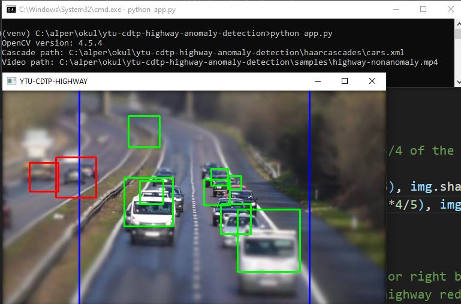

# YTU CDTP Highway Anomaly Detection
This project aiming to detect anomly from highway road cameras.

This project uses venv for manage python virtual environment so follow this guideline.  

# 1-Install venv and Create venv
- https://docs.python.org/3/library/venv.html  
- pip install virtualenv
- python -m venv venv
- (Windows) .\venv\Scripts\activate
- (Linux) ./venv/scripts/activate
- You are ready to go!!!

# 2-Usage
- Go to project directory via activated venv cli
- pip install -r requirements.txt
- python app.py 
- You will see output like this.  

